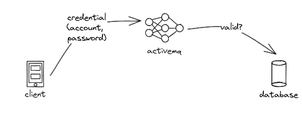
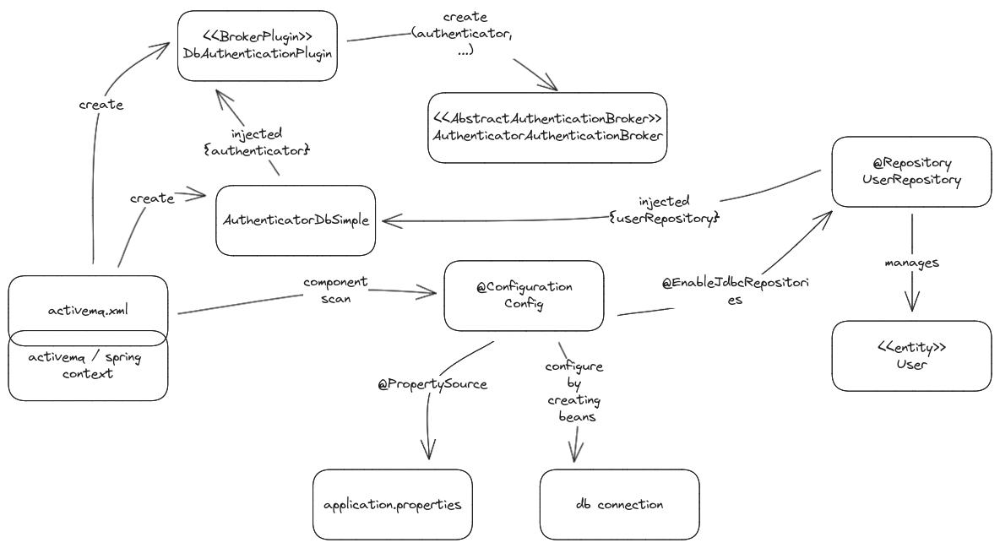
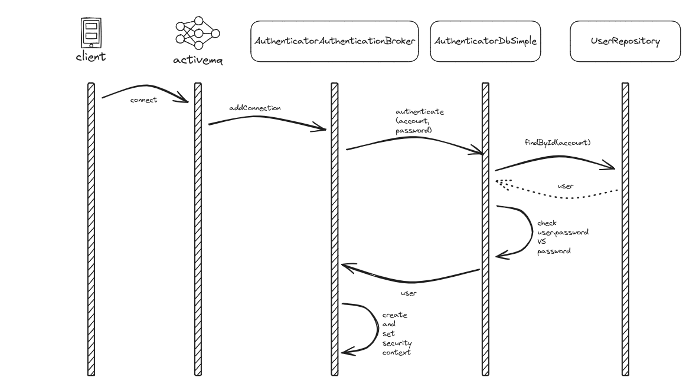

# activemqdbauth

This project provides a configurable activemq plugin to enable authentication tied to 
credential stored in a repository.

This document contains:
- [The architecture and the design of the plugin](#architecture-and-design).
- [A brief HOWTO on how to do things with spring (without spring boot)](#howto-do-things-with-spring-without-spring-boot).
- A Brief HOWTO on [how to implement a plugin for activemq](#howto-implement-activemq-plugin) 
- A Brief HOWTO on [how to enable a plugin in activemq](#howto-enable-a-plugin-in-activemq).

Immersed in the contents listed above there are also the reasons of some constraints and decisions 
that lead to the plugin architecture and design.

# Conventions

With  are annotated all the stuff that are supposed to have been done 
because of the lack of the usage of spring boot. Likely some of them could be avoided if spring 
boot were used.

With `[spring-boot-missing?]` were noted all those things that had to be done due to not having 
used spring boot. Probably using spring boot some could have been avoided. 
Note: spring boot was not intentionally used to minimize the dependencies.

# Architecture and design

The architecture and design are impacted by activemq plugins framework so be sure read 
[HOWTO implement activemq plugin](#howto-implement-activemq-plugin) after this chapter. An option 
is to read that chapter before this one.  
Another driver that impacted architecture and design is the goal of the project: **allow activemq 
to validate client credential against the one saved in a database (db)**:  
  
The last important driver to highlight is the one we wanted to minimize dependencies. For the 
reason that, by having to install the plugin in the activemq runtime, fewer dependencies mean fewer 
compatibility problems with those of activemq itself.

<a name="architecture-and-design-components-diagram"></a>The following is the component diagram and below the description:  
  
activemq is a java program that uses spring. when it starts load the context from the 
`activemq.xml` file. Details on such a file are in 
[How to enable a plugin in activemq](#howto-enable-a-plugin-in-activemq). In such a file it is 
enabled the component scan in order to scan the project for the components. That is needed to scan 
for `@Configuation` components too, and so `Config` is found that has the responsibility of:
- Enabling the loading and the management of the `application.properties`.
- Configuring the db connection by creating the relevant beans.
- Enabling the JDBC repositories.

Additionally, in the `activemq.xml` file:
- It is created the authenticator bean, that is of type `AuthenticatorDbSimple` bean that receives 
  (by autowiring) the `@Repository`. 
- It is created the plugin bean, that is of type `DbAuthenticationPlugin`; 
  to this bean it is injected (by setter injection) the authenticator bean.

The responsibility of the plugin bean is the one of installing the actual plugin by creating it, 
and that is obtained by instantiating the class `AuthenticatorAuthenticationBroker`.

The following is the sequence diagram and below the description:
  
The interaction is initiated by a client that wants to connect to activemq. That happens by 
providing the credential. The only type of managed credential is account/password. At this point 
activemq invokes the registered broker plugins by calling the `addConnection`. The 
`AuthenticatorAuthenticationBroker` then delegates to `AuthenticationDbSimple` the verification of 
the credentials. Verification consists in:
- Retrieving the used from the repository by `account`.
- Verify the password supplied by the client with the retrieved one.

If `AuthenticationDbSimple.authenticate` returns successfully then 
`AuthenticatorAuthenticationBroker` can set the security context and chains the `addConnection` of 
the next plugin (chains is not shown in the diagrams).

The diagram show only the flow of a successful authentication. A failing authentication is managed 
by throwing a `SecurityException`.

The repository is a `CrudRepository` and JDBC repositories are enabled (instead of JPA repositories 
for example) to minimize the dependencies.

## Test

For the unit and integration test 
[these best practices]https://www.baeldung.com/java-unit-testing-best-practices) 
have been followed.

# HOWTO do things with spring (without spring boot)

## Spring JDBC data

[The reference documentation](https://docs.spring.io/spring-data/jdbc/docs/2.4.18/reference/html/)

Per evitare di dover creare tutti i bean `[spring-boot-missing?]` la 
configurazione estende `AbstractJdbcConfiguration`:
```java
@Configuration
public class Config extends AbstractJdbcConfiguration {
```

Per abilitare i JdbcRepository si deve usare
```java
@Configuration
@EnableJdbcRepositories(basePackages = "com.github.emw7.activemqdbauth.activemq.plugin.auth")
public class Config extends AbstractJdbcConfiguration {
```

## application.properties

Affinché venga caricato l'`application.properties` incluso nel progetto deve 
essere aggiunto `@PropertySource` `[spring-boot-missing?]`:
```java
@Configuration
@PropertySource(
		value={"classpath:application.properties"},
		ignoreResourceNotFound = false)
public class Config extends AbstractJdbcConfiguration {
```

## Integration tests

### Component scan

Nei test di integrazione è necessario usare `@Import(Config.class)` (oppure si 
può usare `@ComponentScan("com.github.emw7.activemqdbauth")`) per caricare i 
componenti (nel progetto non ci sono altri componenti oltre a `@Configuration`). 

### Additional test configuration

Nei test di integrazione è stato necessario definire una test configuration per:
- Istanziare un bean di tipo `PropertySourcesPlaceholderConfigurer`.
- Istanziare un bean `authenticatorDbSimple` di tipo `AuthenticatorDbSimple`.

As those beans are needed by activemq too below it is depicted how to that 
for activemq context for 
[HOWTO enable a plugin in activemq/PropertySourcesPlaceholderConfigurer bean](#propertysourcesplaceholderconfigurer-bean) 
and for 
[HOWTO enable a plugin in activemq/Authenticator bean](#authenticator-bean).
```java
  @Configuration
  @Import(Config.class)
  public static class SpringConfig {
    @Bean
    public static PropertySourcesPlaceholderConfigurer propertiesResolver() {
      return new PropertySourcesPlaceholderConfigurer();
    }

    @Bean
    public static AuthenticatorDbSimple authenticatorDbSimple () {
      return new AuthenticatorDbSimple();
    }
  }
```

# HOWTO implement activemq plugin

TODO

[The reference documentation](https://activemq.apache.org/components/classic/documentation/developing-plugins)

# HOWTO enable a plugin in activemq

In this chapter it is described how to enable a plugin in activemq.
The examples refer to the plugin developed within the `activemqdbauth` project.
Some other information can be found in the [Architecture and design/Components diagram](#architecture-and-design-components-diagram)

## Component scan

As done for [Integration tests/Component scan](#component-scan), activemq too must 
find components and to enable that this piece of code must be put in the 
activemq's configuration file (<a name="activemq-xml-configuration"></a>usually 
`.../conf/activemq.xml`) `[spring-boot-missing?]`:
```xml
<context:component-scan base-package="com.github.emw7.activemqdbauth"/>
```

## PropertySourcesPlaceholderConfigurer bean

Because of the plugin uses the `@PropertySource` and the `@Value` annotations 
it is needed to use a `PropertySourcesPlaceholderConfigurer` bean in place of 
the default `PropertyPlaceholderConfigurer`. 
That is obtained by replacing 
`org.springframework.beans.factory.config.PropertyPlaceholderConfigurer` 
with `org.springframework.context.support.PropertySourcesPlaceholderConfigurer` 
[activemq configuration](#activemq-xml-configuration"):
```xml
<bean class="org.springframework.context.support.PropertySourcesPlaceholderConfigurer">
  <property name="locations">
    <value>file:${activemq.conf}/credentials.properties</value>
  </property>
</bean>
```

## Authenticator bean

The plugin depends on an `Authenticator` bean it is needed to add it to the 
activemq context; that is obtained by adding the following rows to the
[activemq configuration](#activemq-xml-configuration"):
```xml
<bean id="authenticator"
class="com.github.emw7.activemqdbauth.activemq.plugin.auth.AuthenticatorDbSimple"/>
```

## Plugin enablement

To enable the plugin in ActiveMQ, as per the ActiveMQ documentation, you need 
to create the plugin within the `<broker>` section. The plugin is essentially 
a bean that extends `org.apache.activemq.broker.BrokerPlugin`, whose task is 
to create the 'real' instance of the plugin. Note that it is possible to use 
other beans (such as `authenticator` in this case). Below is an excerpt from 
the [activemq configuration](#activemq-xml-configurazione):
```xml
<!--
    The <broker> element is used to configure the ActiveMQ broker.
-->
<broker xmlns="http://activemq.apache.org/schema/core" brokerName="localhost" dataDirectory="${activemq.data}">

    <!-- EMW7-->
    <plugins>
        <bean id="authenticationPlugin" xmlns="http://www.springframework.org/schema/beans"
              class="com.github.emw7.activemqdbauth.activemq.plugin.auth.DbAuthenticationPlugin">
            <property name="authenticator" ref="authenticator"/>
        </bean>
    </plugins>
```

## Plugin jar and dependencies installation

The plugin has dependencies (jars) that must be installed together with the plugin jar itself. 
There are tow points of attention:
- Some plugin's dependencies are already provided by.
- Some plugin's dependencies could by provided by activemq but at a different version.

To face that two points has been decided to make the plugin dependent from libraries that are 
provided by activemq compatible at major and minor parts ignoring fix part and to install only the 
dependencies that are not activemq dependencies already.  
> **Example**:  
> activemq depends on `foo-5.4.3` library  
> plugin needs `foo` library too and the last version in the 5.4 branch is 5.4.9 then the plugin 
>   depends on `foo-5.4.9`  
> plugin needs `bar` library too (and `bar` is not a dependency of activemq) so we are free to 
>   choose last `bar` version  
> the plugin is installed together with `bar` library only as `foo` is supposed to be provided 
>   by activemq's one (hopping fix differences does not cause problems)  
> **Note**: that is easy for independent libraries but if there are transitional dependencies it 
>   could be harder to choose the right versions

# Miscellaneous stuff

- To configure the data source it is not possible to use the `spring.datasource` properties because 
  it seems they are used by spring boot autoconfiguration.

# TODO 

- Manage active in AuthenticatorDbSimple.
